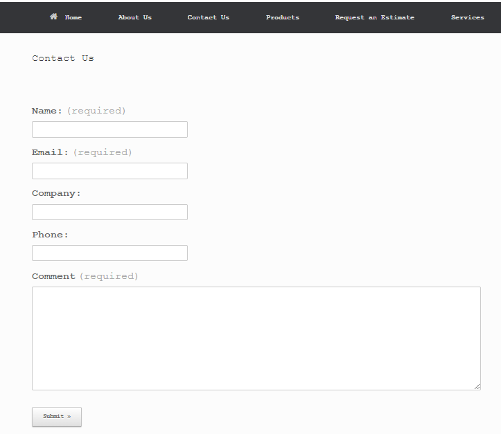

Bryce_Yncera_Personal_Project
============================

My group project was a tremendous learning experience in regards to working with WordPress due to the fact that I did not know that word press existed before this class. 
However I did not have the opportunity to fully implement some of the features that WordPress offers, due to the requirements that Skytouch had in the project. 
The main thing was we had to use a very basic theme that had little to no functionality besides changing the CSS of the website.
That is why in my personal Project I created a fictional company website that utilizes a more robust theme. The theme that I used is called Vantage made by siteorigin. 
Unlike most themes that are on WordPress that are strictly for the CSS of the website. This theme allows you to customize your website far more than other themes on WordPress 
You are able to insert contact forms, sideshows product pages and more as well as the basic CSS that other themes allow you to do without the need of adding in more plugins.
I will now be going over how I implemented the theme and the functionality of the theme. For reference the link to my live website is listed here: http://bynceraproject.com/

Contact Form
============================
Contact Forms are an essential part of any company's website. The great thing about the Vantage theme is that it allows you to create contact forms with in the page, without 
having to download and maintain other plugins as shown below.

As you can see from the Image above all you need to do is is click "Add Contact Form" in order to start the process. After that the image below will appear

You have the ability to customize the form how you see fit. The below image shows how the email function of the contact form works.

After you fill in the required filled all that next is to hit create form and it will automatically be added into your page no other work is required at that point. Below is how my two contact forms turned out.

 

The above image is a very basic contact form someone can make for a website. To illustrate a more complex form that can be made with the built in form builder I created a Request an Estimate page that will help show that. I did little more besides add in the fields that I wanted and hit create form.

 

 

Site Customization
============================
Next we are going to talk about how the Vantage theme allow you to have more options when it comes to site customization. 
The below image shows my group project and what it looks like when you want to customize it theme shows how.

 

Now let me show in the Vantage theme in comparison.

 

As you can see there are far more options that allow you to Customize my site compared to a basic theme. This allows me to changes the fonts of the whole site. How the pages are laid out, how the menu is laid out, page color back grounds, and Ajax comments in the page breakdown. I found that in order to show that this is a website for a printing company I would use Courier New font, because it is something that most company use in the printing industry. The below image shows just how many options this new Theme gives for CSS customization. 

Through this personal project I was able to show that WordPress has very powerful tools that allow you to make a great website. One of those tools is called Vantage and it allows you to go beyond that of a normal theme and give you the ability to drastically change the way your website looks without hours of coding. 

**To see how the full site turned out please visit: http://bynceraproject.com/**
